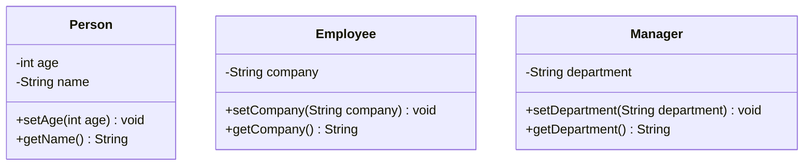

# CodeGenerator
PD-2 HW2

## Mermaid Class Diagram to Java Code Generator - README

### Introduction to Mermaid (中文版)
Mermaid 是一個基於標記語言的圖表生成工具，允許用戶使用類似 Markdown 的語法創建流程圖、序列圖、甘特圖等各類圖表。這使得開發者能夠輕鬆地在文檔中展示複雜的結構和流程，而無需使用專業的圖形軟件。Mermaid Class Diagram 是其中的一個工具，用於以結構化的方式展示類之間的關係，類似於 UML 類圖。

本工具的目標是將 Mermaid Class Diagram 轉換為 Java 類源代碼。這是一個簡單的代碼生成器，通過 Mermaid 語法解析並輸出對應的 Java 類文件。

### Mermaid Class Diagram to Java Code Generator (English version)

Mermaid is a markup-based diagramming tool that allows users to create various diagrams such as flowcharts, sequence diagrams, and Gantt charts with Markdown-like syntax. This enables developers to quickly include complex visual structures in documentation without needing specialized graphical software. The Mermaid Class Diagram is a tool within Mermaid that represents relationships between classes in a structured way, similar to UML class diagrams.

This tool's goal is to convert a Mermaid Class Diagram into corresponding Java source code. It serves as a simple code generator that parses Mermaid syntax and generates Java class files accordingly.

---

## How to Use

1. **Input Format:**

   - The input is a Mermaid Class Diagram, where each class is defined by `class <ClassName>`, followed by its attributes and methods.
   - Attributes and methods are defined using `:` and each class member is prefixed with `+` (for public) or `-` (for private).
   - Attributes will have a type but no parentheses, whereas methods will have parentheses and a return type after the parentheses.

   Example of a Mermaid Class Diagram:
   ```
   classDiagram
   class BankAccount {
       -String owner
       -int balance
       +setOwner(String owner) void
       +getOwner() String
       +isEnough(int value, int balance) boolean
   }
   ```

2. **Java Code Output:**

   - The tool will generate a corresponding `.java` file for each class in the Mermaid diagram.
   - The file name will match the class name, and the class will include private fields, constructors, getters, setters, and any other specified methods.
   - Methods will include the correct return types and default return values for non-getter/setter methods (int returns 0, String returns "", boolean returns false).

   Example of the corresponding Java output:
   ```java
   public class BankAccount {
       private String owner;
       private int balance;

       public void setOwner(String owner) {
           this.owner = owner;
       }

       public String getOwner() {
           return owner;
       }

       public boolean isEnough(int value, int balance) {
           return false;  // Default return for boolean
       }
   }
   ```

3. **Compile Instructions:**

   - Compile the main class `CodeGenerator.java`:
     ```
     javac CodeGenerator.java
     ```

   - Run the tool by passing the input file name:
     ```
     java CodeGenerator <input-file>
     ```

   - The tool will generate `.java` files for each class in the diagram.

4. **File Structure:**

   - Each class will have a file with the same name as the class.
   - Classes will have private attributes and methods defined in the diagram.
   - Getter and Setter methods will be automatically generated for each class attribute.

---

## Input File Example (輸入文件範例)



## Output Example (輸出範例)

For the above input, the tool will generate three files: `Person.java`, `Employee.java`, and `Manager.java`.

### Person.java:
```java
public class Person {
    private int age;
    private String name;

    public void setAge(int age) {
        this.age = age;
    }

    public String getName() {
        return name;
    }
}
```

### Employee.java:
```java
public class Employee {
    private String company;

    public void setCompany(String company) {
        this.company = company;
    }

    public String getCompany() {
        return company;
    }
}
```

### Manager.java:
```java
public class Manager {
    private String department;

    public void setDepartment(String department) {
        this.department = department;
    }

    public String getDepartment() {
        return department;
    }
}
```

---

## Notes

- All attributes in the generated Java class are private, and the methods are public.
- The tool automatically handles getter and setter generation based on method names starting with "get" and "set".
- Default return values are used for non-getter/setter methods.

This tool simplifies Mermaid class diagrams into structured Java code, ideal for quick prototyping or generating boilerplate code.

