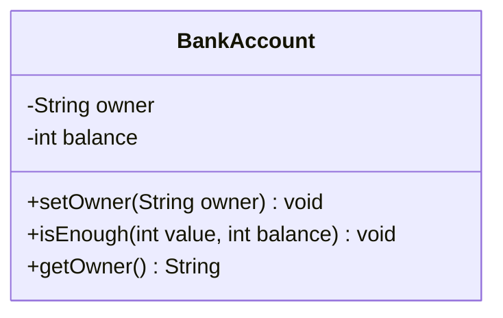

CodeGenerator
PD2-HW2


Here's the bilingual README for your "Mermaid Class Diagram to Java Code Generator" project:

This README provides all the essential information for your project in both English and Chinese. You can modify the repository URL as needed.
---

# Code Generator for Mermaid Class Diagram


### Introduction
This project is a simple code generator that converts Mermaid class diagrams into Java source code. Mermaid is a JavaScript-based diagramming and charting tool, rendering diagrams using Markdown-like syntax. This tool allows you to easily represent class relationships and their interactions, similar to UML diagrams, in a Markdown-based format.

### Features
- Converts Mermaid class diagrams to Java classes.
- Automatically generates setter and getter methods for private attributes.
- Supports basic Mermaid syntax for defining class attributes and methods.
- Handles public and private access modifiers.

### Example

#### Input (Mermaid Diagram):


#### Output (Java Code):
```java
class BankAccount {
    private String owner;
    private int balance;

    public void setOwner(String owner) {
        this.owner = owner;
    }

    public void isEnough(int value, int balance) {;}

    public String getOwner() {
        return owner;
    }
}
```

### Installation
To run the project, follow these steps:

1. Clone the repository to your local machine.
   ```bash
   git clone https://github.com/yourusername/mermaid-code-generator.git
   ```
2. Compile the `CodeGenerator.java` file.
   ```bash
   javac CodeGenerator.java
   ```
3. Run the code generator with a test case file.
   ```bash
   java CodeGenerator test_case.txt
   ```

### How to Use
1. Prepare a Mermaid class diagram in a text file (e.g., `test_case.txt`).
2. Run the program, and the tool will generate corresponding Java files for each class defined in the Mermaid diagram.


---


### 介紹
這是一個簡單的代碼生成器，用於將Mermaid類圖轉換為Java源代碼。Mermaid是一種基於JavaScript的繪圖和製圖工具，使用類似Markdown的語法來生成圖表。這個工具可以輕鬆地用Markdown格式來表示類之間的關係和互動，類似於UML類圖。

### 功能
- 將Mermaid類圖轉換為Java類。
- 自動生成私有屬性的setter和getter方法。
- 支援Mermaid語法中的基本類屬性和方法定義。
- 處理公有和私有存取修飾符。

### 範例

#### 輸入（Mermaid類圖）：


#### 輸出（Java代碼）：
```java
class BankAccount {
    private String owner;
    private int balance;

    public void setOwner(String owner) {
        this.owner = owner;
    }

    public void isEnough(int value, int balance) {;}

    public String getOwner() {
        return owner;
    }
}
```

### 安裝
請按照以下步驟來運行項目：

1. 將倉庫克隆到本地電腦。
   ```bash
   git clone https://github.com/yourusername/mermaid-code-generator.git
   ```
2. 編譯 `CodeGenerator.java` 文件。
   ```bash
   javac CodeGenerator.java
   ```
3. 使用測試檔運行代碼生成器。
   ```bash
   java CodeGenerator test_case.txt
   ```

### 使用方法
1. 準備包含Mermaid類圖的文字檔案（例如 `test_case.txt`）。
2. 執行程式，工具將為Mermaid類圖中的每個類生成對應的Java文件。


---

